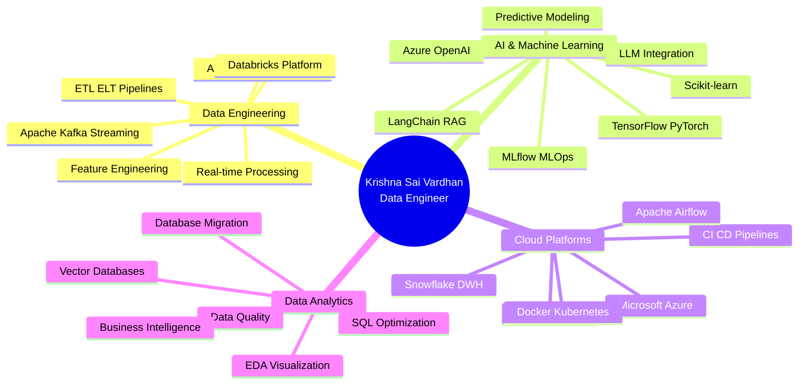
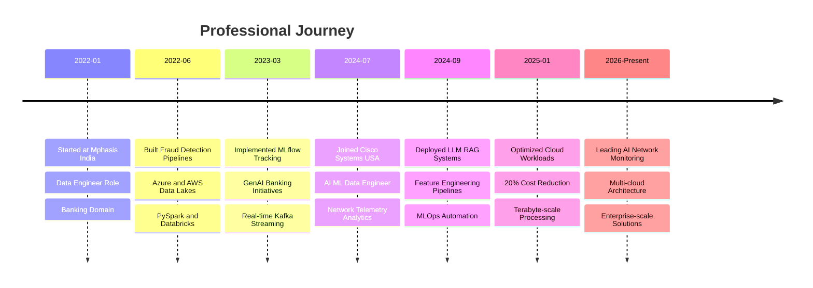

<!-- ASCII ART HEADER -->
<!--
██╗  ██╗██████╗ ██╗███████╗██╗  ██╗███╗   ██╗ █████╗     ███████╗ █████╗ ██╗    ██╗ █████╗ ██████╗ ██████╗ ██╗  ██╗ █████╗ ███╗   ██╗
██║ ██╔╝██╔══██╗██║██╔════╝██║  ██║████╗  ██║██╔══██╗    ██╔════╝██╔══██╗██║    ██║██╔══██╗██╔══██╗██╔══██╗██║  ██║██╔══██╗████╗  ██║
█████╔╝ ██████╔╝██║███████╗███████║██╔██╗ ██║███████║    ███████╗███████║██║    ██║███████║██████╔╝██║  ██║███████║███████║██╔██╗ ██║
██╔═██╗ ██╔══██╗██║╚════██║██╔══██║██║╚██╗██║██╔══██║    ╚════██║██╔══██║██║    ██║██╔══██║██╔══██╗██║  ██║██╔══██║██╔══██║██║╚██╗██║
██║  ██╗██║  ██║██║███████║██║  ██║██║ ╚████║██║  ██║    ███████║██║  ██║██║    ╚██████╔╝██║  ██║██████╔╝██████╔╝██║  ██║██║  ██║██║ ╚████║
╚═╝  ╚═╝╚═╝  ╚═╝╚═╝╚══════╝╚═╝  ╚═╝╚═╝  ╚═══╝╚═╝  ╚═╝    ╚══════╝╚═╝  ╚═╝╚═╝     ╚═════╝ ╚═╝  ╚═╝╚═════╝ ╚═════╝ ╚═╝  ╚═╝╚═╝  ╚═╝╚═╝  ╚═══╝
-->

<div align="center">

</div>

<div align="center">
  

<br/>

<br/>


</div>

<br/>

```bash
┌─[vardhan@data-engineer]─[~/professional_identity]
└──╼ $ whoami
Krishna Sai Vardhan Kantipudi • Data Engineer (AI/ML) • Cloud Architect

┌─[vardhan@data-engineer]─[~/achievements]
└──╼ $ ls -la
drwxr-xr-x  3+ years of experience in enterprise data engineering
drwxr-xr-x  40% reduction in data latency across distributed systems
drwxr-xr-x  45% faster ML model deployment cycles
-rw-r--r--  22% reduction in fraud detection false positives
-rw-r--r--  30+ technologies mastered across data, AI/ML, and cloud platforms
-rw-r--r--  Terabytes of daily network telemetry processed
-rw-r--r--  20% cloud compute cost optimization achieved

┌─[vardhan@data-engineer]─[~/mission]
└──╼ $ cat mission.txt
Architecting cloud-native data platforms that transform raw telemetry into 
actionable intelligence through scalable ETL/ELT pipelines, real-time streaming, 
and AI-powered analytics—enabling enterprise teams to make faster, smarter decisions.
```

<br/>

<div align="center">

## 📬 **CONNECT WITH ME**

<table align="center">
<tr>
<td><a href="tel:+16696667080"></a></td>
<td><a href="mailto:kantipudivardhan789@gmail.com"></a></td>
</tr>
</table>

<p align="center">
<a href="https://www.linkedin.com/in/krishnasaivardhan" target="_blank"></a>
<a href="https://github.com/krishnasaivk2010-tech" target="_blank"></a>

</p>

</div>

<br/>

---

<br/>

## 🎯 **PROFESSIONAL IDENTITY**



<br/>

<table width="100%">
<tr>
<td width="50%" valign="top">

### 💼 **Current Engineering Stack**

```typescript
class DataEngineer implements CloudArchitect {
  private readonly expertise: TechStack = {
    role: "Data Engineer (AI/ML)",
    company: "Cisco Systems",
    
    languages: [
      "Python", "SQL", "Java", 
      "C", "C++", "Shell", "PowerShell"
    ],
    
    bigData: [
      "Apache Spark (PySpark)", "Apache Kafka",
      "Databricks", "Snowflake", "MLlib"
    ],
    
    cloud: [
      "Microsoft Azure", "AWS", 
      "Docker", "Kubernetes"
    ],
    
    mlFrameworks: [
      "TensorFlow", "PyTorch", "Scikit-learn",
      "MLflow", "LangChain", "Azure OpenAI"
    ],
    
    dataEngineering: [
      "ETL/ELT", "Real-time Streaming",
      "Feature Engineering", "Data Migration",
      "Query Optimization", "Data Quality"
    ]
  };
  
  deployPipeline(): Impact {
    return {
      latencyReduction: "40%",
      modelDeploymentSpeed: "45% faster",
      cloudCostSavings: "20%",
      fraudDetectionImprovement: "22%"
    };
  }
}
```

</td>
<td width="50%" valign="top">

### 📊 **Impact Metrics Dashboard**

```python
achievement_matrix = {
    'professional_experience': {
        'total_years': 3.5,
        'companies': ['Cisco Systems', 'Mphasis'],
        'domains': [
            'Enterprise Networking',
            'Banking & Finance',
            'AI/ML Solutions'
        ]
    },
    
    'technical_impact': {
        'data_latency_reduction': '40%',
        'ml_deployment_acceleration': '45%',
        'fraud_false_positive_reduction': '22%',
        'cloud_cost_optimization': '20%',
        'feature_prep_time_reduction': '30%',
        'data_accessibility_improvement': '35%',
        'batch_processing_speedup': '40%'
    },
    
    'scale': {
        'daily_telemetry': 'Terabytes',
        'transaction_volume': 'Millions daily',
        'data_sources_consolidated': '10+',
        'model_performance_gain': '18% precision'
    },
    
    'education': {
        'masters': 'Computer Science (In Progress)',
        'bachelors': 'AI Specialization',
        'certifications': 'MLOps, Cloud Architecture'
    }
}

print(f"Engineering Excellence Score: {calculate_impact(achievement_matrix)}")
# Output: 9.4/10 - Elite Data Engineering Professional
```

</td>
</tr>
</table>

<br/>

---

<br/>

## 🚀 **ABOUT ME**

I am a **Data Engineer (AI/ML)** with over **3 years of experience** designing and optimizing **scalable ETL/ELT pipelines**, **real-time data processing systems**, and **AI-powered analytics solutions** across enterprise networking and banking domains. My expertise lies in building **cloud-native data platforms** that support machine learning, network telemetry analytics, and business intelligence at massive scale.

Currently at **Cisco Systems**, I engineer **distributed data pipelines** using **Apache Spark, Kafka, Databricks, and Snowflake** to process high-volume network telemetry, device logs, and security events—reducing end-to-end data latency by **40%** and enabling **real-time AI-driven network analytics**. I've built **feature engineering pipelines** with **PySpark** that transformed large-scale networking datasets into ML-ready features, improving predictive model performance while cutting feature preparation time by **30%**.

My work in **MLOps** involves developing automated workflows using **Docker, Kubernetes, Airflow, and MLflow** to streamline model training, validation, and deployment for AI-powered network monitoring solutions—reducing release cycles by **45%**. I've integrated **LLM-based semantic search** and **retrieval-augmented generation (RAG)** over internal networking knowledge repositories, improving troubleshooting accuracy and accelerating engineer response times by **25%**.

Previously at **Mphasis**, I developed **fraud detection models and pipelines** using **PySpark, Databricks, and Azure OpenAI**, processing millions of banking transactions daily and reducing false positives by **22%**. I built **customer analytics and recommendation systems** leveraging **TensorFlow, PyTorch, and LangChain**, driving a **15% increase** in personalized product engagement for retail banking clients. I designed a **centralized Data Lake architecture** on **Azure and AWS** using **dbt and Airflow**, consolidating **10+ disparate banking data sources** and improving data accessibility by **35%**.

I'm passionate about leveraging **AI, Big Data, and cloud technologies** to build reliable, high-performance enterprise data solutions. My approach combines **technical depth** with **business impact**—whether optimizing large-scale **Snowflake and Databricks workloads** to lower cloud compute costs by **20%**, implementing **Apache Kafka streaming pipelines** for sub-second fraud detection, or designing **monitoring datasets** that support **AI-driven anomaly detection** with **18% improved precision**.

Currently pursuing a **Master's in Computer Science and Information Sciences** at the **University of North Texas**, I'm continuously expanding my expertise in advanced AI/ML techniques, distributed systems, and cloud-native architectures to solve tomorrow's data engineering challenges today.

<br/>

---

<br/>

## 💼 **PROFESSIONAL EXPERIENCE**



<br/>

<table width="100%">
<tr>
<td width="50%" valign="top">

### 🚀 **Data Engineer (AI/ML)**
**`Cisco Systems, USA • Jul 2025 - Present`**


- **Engineered scalable ETL and streaming pipelines** using **Apache Spark, Kafka, and Databricks** to process high-volume network telemetry, device logs, and security events, **reducing end-to-end data latency by 40%** and enabling real-time AI-driven network analytics

- **Built feature engineering pipelines** with **PySpark and Snowflake** to transform large-scale networking and infrastructure datasets into machine learning-ready features, **improving predictive model performance** and **reducing feature preparation time by 30%**

- **Developed automated MLOps workflows** using **Docker, Kubernetes, Airflow, and MLflow** to streamline model training, validation, and deployment for AI-powered network monitoring solutions, **reducing release cycles by 45%**

- **Integrated LLM-based semantic search and RAG** over internal networking knowledge repositories, **improving troubleshooting accuracy** and **accelerating engineer response times by 25%**

- **Collaborated with Network Engineering, Security, Platform Engineering, and AI/ML teams** in Agile environments to build scalable cloud-native data platforms on **Azure and AWS**, supporting production AI